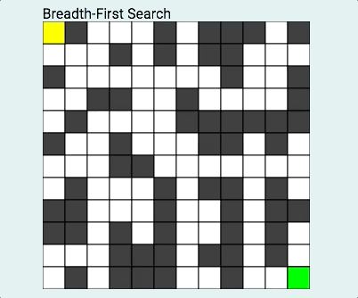
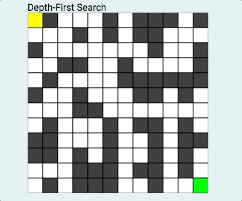

# BFS and DFS
Breadth-first search and depth-first search pathfinder visualizer using
regular JavaScript (some jQuery) and HTML canvas.


# Breadth-First Search



BFS is an algorithm that start at the starting node and explores its neighbors first, before moving on to their neighbors. My implementation is non-recursive, as it uses a `Queue` and checks whether the node has been visited or not.

```javascript
let queue = new Queue();
queue.enqueue(startNode);
cameFrom[startNode.id] = null;
while (true) {
  current = queue.dequeue();
  current.visited = true;
  path.push(current.id);
  if (current.id === targetNode.id) {
    break;
  }
  current.adj.forEach((id) => {
    if (cameFrom[id]) {
    } else {
      cameFrom[id] = current.id;
    }

    let node = getNodeById(graph, id);
    if (!node.visited) {
      node.visited = true;
      queue.enqueue(node);
    }
  });
```  

# Depth-First Search



DFS is different algorithm in that it first starts with the starting node then selects a path and travels that path as far as it can before backtracking. It implemented  non-recursively using a `Stack`, keeping track of its visited neighbors.

```javascript
let stack = new Stack();
stack.push(startNode);
cameFrom[startNode.id] = null;
while (true) {
  current = stack.top();
  path.push(current.id);
  current.visited = true;
  if (current.id === targetNode.id) {
    break;
  }
  let unvisited = 0;
  current.adj.forEach((id) => {
    let node = getNodeById(graph, id);
    if (!node.visited) {
      if (cameFrom[id]) {
      } else {
        cameFrom[id] = current.id;
      }
      stack.push(node);
      unvisited += 1;
    }
  });
  if (unvisited === 0) {
    stack.pop();
  }
}
```

* This are open source code being modified to suit our needs.
